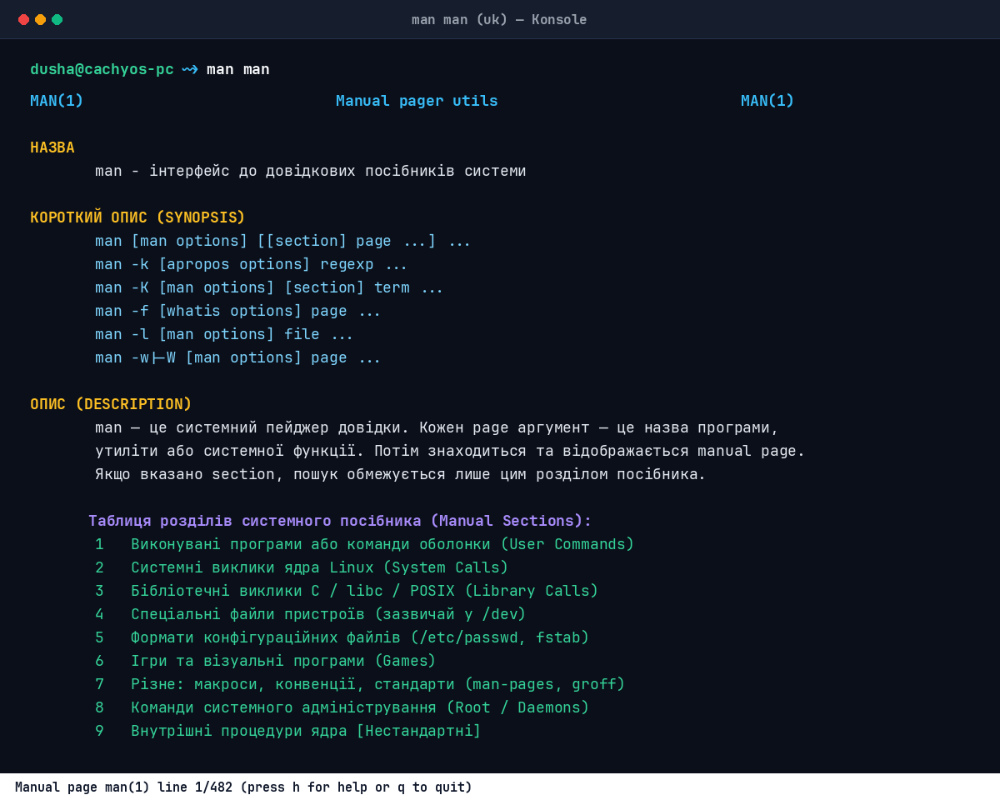
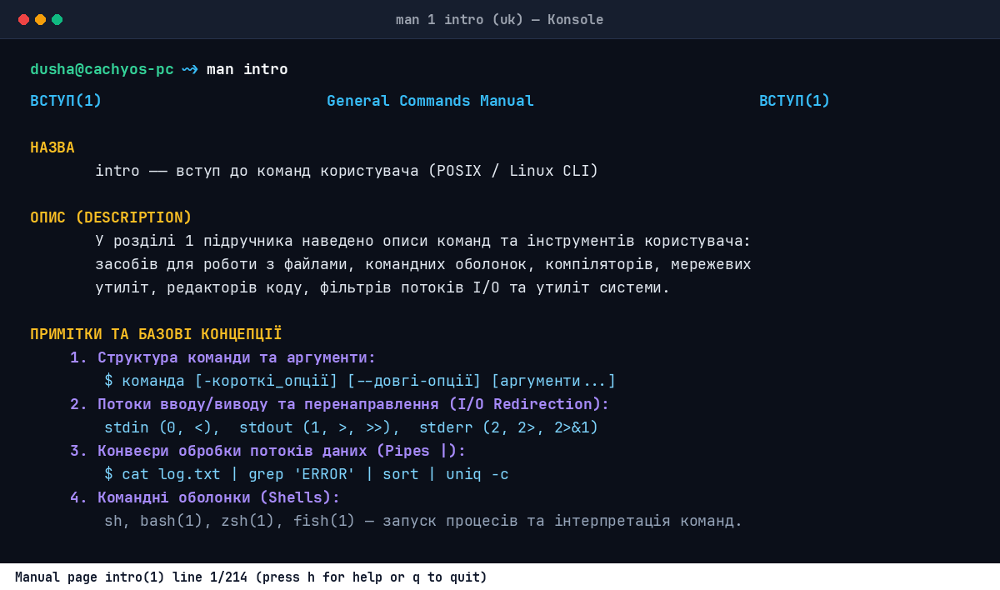

# 📖 man.ua — Українська системна документація та довідник Man-Pages

[](https://cachyos.org)
[](https://ubuntu.com)
[-blue?style=flat-square)](https://github.com)
[](https://man7.org)
[](LICENSE)

> **`man.ua`** — це централізований репозиторій та довідковий центр перекладу, стандартизації та систематизації системної документації **Linux man-pages** українською мовою.

---

## 📌 Про проєкт

Проєкт **`man.ua`** ставить за мету надати україномовним користувачам, системним адміністраторам, DevOps-інженерам та розробникам повний, вичерпний та професійно локалізований доступ до системної документації UNIX/Linux без мовних бар'єрів.

### 🌟 Ключові напрямки:
* 🌐 **100% якісна українська термінологія**: усунення кальки та автоперекладу на користь точних усталених технічних стандартів.
* ⚡ **Покриття всіх 9 розділів man**: від щоденних консольних утиліт до системних викликів ядра та стандартів POSIX.
* 🛠️ **Інтеграція в дистрибутиви**: пряме розгортання в `/usr/share/man/uk/` з підтримкою `mandb`, `man` та термінальних переглядачів (`less`, `bat`, `glow`).
* 🚀 **Офлайн-автономність**: повна доступність посібників без потреби в інтернет-з'єднанні.

---

## 📚 Розділи системного посібника (Man-Pages Sections 1–9)

Системна документація Linux чітко розбита на **9 стандартизованих розділів**, кожен з яких відповідає за свій рівень взаємодії з системою:

| Розділ | Категорія | Опис призначення | Приклади виклику |
| :---: | :--- | :--- | :--- |
| **1** | **Виконувані програми та команди оболонки** | Користувацькі утиліти, бінарні програми, інструменти обробки тексту, компілятори та командні оболонки. | `man 1 ls`<br>`man 1 grep`<br>`man 1 intro`<br>`man 1 tar` |
| **2** | **Системні виклики ядра Linux** | Функції ядра Linux, що забезпечують пряму взаємодію між простором користувача (user-space) та ядром (kernel-space). | `man 2 open`<br>`man 2 read`<br>`man 2 fork`<br>`man 2 clone` |
| **3** | **Бібліотечні виклики C / libc / POSIX API** | Функції стандартної бібліотеки мови C (`glibc`, `musl`) та системних бібліотек (`libwayland`, `libcurl`, `pthreads`). | `man 3 printf`<br>`man 3 malloc`<br>`man 3 wl_display_connect`<br>`man 3 pthread_create` |
| **4** | **Спеціальні файли та пристрої (`/dev`)** | Інтерфейси драйверів пристроїв, віртуальні та символьні пристрої у файловій системі. | `man 4 null`<br>`man 4 tty`<br>`man 4 random`<br>`man 4 loop` |
| **5** | **Формати конфігураційних файлів та угоди** | Синтаксис та правила оформлення системних конфігураційних файлів (`/etc/*`), баз даних та форматів файлів. | `man 5 passwd`<br>`man 5 fstab`<br>`man 5 crontab`<br>`man 5 systemd.unit` |
| **6** | **Ігри та розваги** | Текстові та графічні консольні ігри, генератори заставок, анімації та розважальні програми. | `man 6 sl`<br>`man 6 fortune`<br>`man 6 bsd-games`<br>`man 6 factor` |
| **7** | **Огляди, конвенції, стандарти та макроси** | Оглядові статті, мережеві протоколи, таблиці кодувань, стандарти POSIX, структура ФС та макропакети (`groff`). | `man 7 ip`<br>`man 7 tcp`<br>`man 7 hier`<br>`man 7 utf-8`<br>`man 7 man-pages` |
| **8** | **Команди системного адміністрування** | Утиліти керування службами, демонами, дисковими розділами, мережею та безпекою (зазвичай вимагають привілеїв `root`). | `man 8 systemctl`<br>`man 8 btrfs`<br>`man 8 fdisk`<br>`man 8 iptables`<br>`man 8 pacman` |
| **9** | **Внутрішні підпрограми ядра Linux** | Нестандартний розділ документації внутрішніх інтерфейсів ядра, підсистем та модулів розробки драйверів. | `man 9 kmalloc`<br>`man 9 sk_buff` |

---

## 🛠️ Встановлення та налаштування на системі (CachyOS vs Ubuntu)

Щоб система автоматично відкривала сторінки українською мовою при виклику `man <команда>`, виконайте інструкцію для вашого дистрибутива:

### 1. ⚡ CachyOS / Arch Linux

#### Крок 1: Встановлення пакетів підтримки `man-db` та українських сторінок
```bash
# Встановлення основного рушія man-db:
sudo pacman -S man-db man-pages

# Встановлення пакету українських man-сторінок з AUR (через paru або yay):
paru -S man-pages-uk
# або:
yay -S man-pages-uk
```

#### Крок 2: Генерація української локалі
Переконайтеся, що в `/etc/locale.gen` розкоментовано рядок `uk_UA.UTF-8 UTF-8`, та згенеруйте локаль:
```bash
sudo locale-gen
```

#### Крок 3: Оновлення індексу бази посібників
```bash
sudo mandb
```

---

### 2. 🐧 Ubuntu / Debian Linux

#### Крок 1: Встановлення пакетів української документації
```bash
sudo apt update
sudo apt install man-db manpages manpages-uk manpages-uk-dev
```

#### Крок 2: Генерація та налаштування локалі
```bash
sudo locale-gen uk_UA.UTF-8
sudo update-locale LANG=uk_UA.UTF-8
```

#### Крок 3: Оновлення індексу бази посібників
```bash
sudo mandb -c
```

---

### 🔄 Порівняльна таблиця відмінностей: CachyOS vs Ubuntu

| Характеристика | ⚡ CachyOS (Arch-based) | 🐧 Ubuntu / Debian |
| :--- | :--- | :--- |
| **Пакетний менеджер** | `pacman` / `paru` / `yay` | `apt` |
| **Пакет українських man** | `man-pages-uk` (AUR) | `manpages-uk`, `manpages-uk-dev` |
| **Формат стиснення сторінок** | `.zst` / `.gz` (висока компресія Zstandard) | `.gz` (Gzip) |
| **Файл конфігурації локалей** | `/etc/locale.gen` + `locale-gen` | `/etc/default/locale` + `update-locale` |
| **Каталог зберігання сторінок** | `/usr/share/man/uk/` | `/usr/share/man/uk/` |
| **Команда оновлення індексу** | `sudo mandb` | `sudo mandb -c` |

---

### 📥 3. Ручне встановлення man-сторінок безпосередньо з цього репозиторію

Якщо ви перекладаєте власні сторінки або бажаєте додати файли з репозиторію `man.ua`:

```bash
# 1. Клонувати репозиторій:
git clone https://github.com/AndreyVeremchuck/man.ua.git
cd man.ua

# 2. Створити необхідні цільові директорії під розділи (наприклад, man1 та man3):
sudo mkdir -p /usr/share/man/uk/man1 /usr/share/man/uk/man3

# 3. Скопіювати man-файли у відповідний розділ:
sudo cp pages/man1/* /usr/share/man/uk/man1/
sudo cp pages/man3/* /usr/share/man/uk/man3/

# 4. Оновити індекс пошуку mandb:
sudo mandb
```

---

### 💡 Як примусово відкривати українську версію (`man -L uk`)

Якщо основна мова вашої системи встановлена англійською (`LANG=en_US.UTF-8`), ви можете викликати український переклад прапорцем `-L uk` або створити зручний аліас:

* **Разовий виклик**:
  ```bash
  man -L uk intro
  man -L uk 1 ls
  man -L uk man
  ```

* **Створення аліасу `uman` (для Fish / Bash / Zsh)**:
  ```bash
  # Для Fish (~/.config/fish/config.fish):
  alias uman="man -L uk"

  # Для Bash/Zsh (~/.bashrc або ~/.zshrc):
  alias uman='man -L uk'
  ```
  Тепер команда `uman intro` миттєво відкриватиме українську документацію!

---

## 🖼️ Візуалізація терміналу та скріншоти

### 1. 📟 Посібник посібників: `man man`
Інтерфейс головної точки входу до системи довідки з переліком усіх розділів та доступних прапорців:



---

### 2. 🔰 Вступ до команд користувача: `man intro` (`man 1 intro`)
Базовий підручник з концепцій UNIX/Linux, конвеєрів (`|`), перенаправлення потоків введення/виведення (`stdin`, `stdout`, `stderr`), масок та керування оболонкою:



---

## ⚡ Швидка шпаргалка роботи з `man`

```bash
# 1. Відкрити посібник для команди:
man ls

# 2. Відкрити посібник із конкретного розділу (наприклад, функція C printf проти команди консолі printf):
man 1 printf   # Команда оболонки printf
man 3 printf   # C-функція бібліотеки libc printf()

man 2 read     # Системний виклик ядра read()
man 1 read     # Вбудована команда оболонки read

# 3. Пошук за ключовими словами в описах (аналог apropos):
man -k "пошук файлів"
man -k network

# 4. Короткий опис команди (аналог whatis):
man -f grep

# 5. Дізнатися шлях до файлу man-сторінки:
man -w btrfs
man -w 3 wl_display_connect

# 6. Перегляд усіх розділів для команди послідовно:
man -a intro
```

---

## 📁 Структура репозиторію

```
man.ua/
├── assets/
│   ├── man_man.png          # Скріншот виклику `man man`
│   └── man_intro.png        # Скріншот виклику `man intro`
├── generate_screenshots.py  # Генератор термінальних скріншотів високої чіткості
├── README.md                # Головний опис проєкту, розділи та документація
└── .gitignore               # Конфігурація ігнорування тимчасових файлів
```

---

## 🤝 Як долучитися до розвитку

1. Створіть форк репозиторію.
2. Додайте або покращіть переклад man-сторінки з дотриманням термінологічних стандартів.
3. Перевірте форматування за допомогою `nroff -mandoc -Tutf8 <файл> | less`.
4. Надішліть Pull Request!

---

*Зроблено в Україні з любов'ю до відкритого коду та Linux.* 🇺🇦
